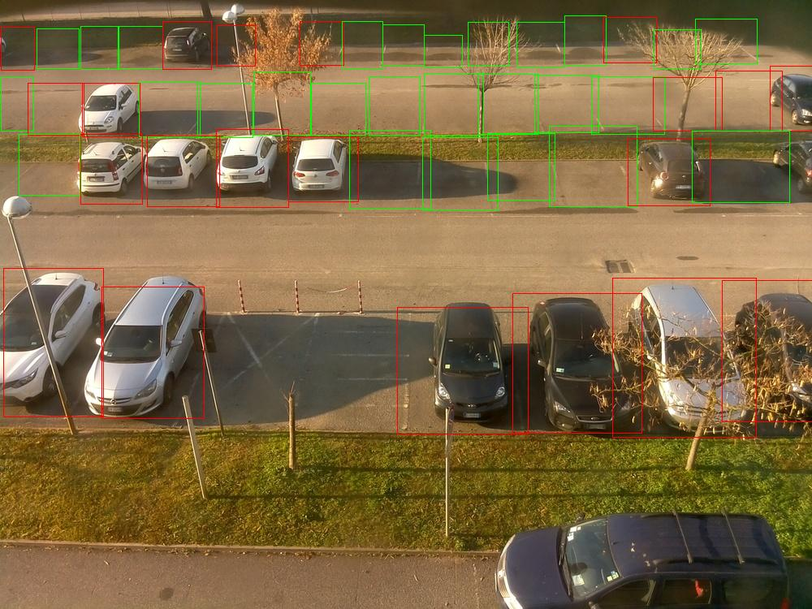

# TensorFlow API- Detecting Parking Lot Spaces Occupied/Empty
This README include directions on how to setup a working version of the tensorflow API for our specific parking lot detection project

Since the tensorflow API is too large to properly push to this directory, I have forked my modifications to the repository shown below.
* [Tensorflow Object Detection API(v1.13.0)](https://github.com/apschuster/models/tree/r1.13.0) - Object Detection API
* WARNING: At the moment, this will only work out of the box for windows users. The paths have not been made in a way that mac/linux users can run this without changing from '\\' to '/'


## Getting Started

Loose Instructions: https://www.geeksforgeeks.org/ml-training-image-classifier-using-tensorflow-object-detection-api/
* These are loose instructions that my own instructions will be slightly based on. They are only meant to give a reference point to how I initially setup/trained my system- DO NOT follow these instructions.

The instructions below will get you a copy of the project up and running on your local machine for development and testing purposes.

### System Requirements
* Windows 10, 64 bit
* Can work on Mac/Linux, but must change hard coded paths to use '/' instead of '\\' that it is currently using.

### Prerequisites

What things you need to install the software

```
Pip version 19.0.0 or newer
Python 3.x (3.7.4 in my case)
A clone of my modification of the object detection API at: Tensorflow Object Detection API(v1.13.0)(https://github.com/apschuster/models/tree/r1.13.0)
pip install tensorflow==1.15.0
pip install protobuf
pip install pillow
pip install lxml
pip install Cython
pip install matplotlib
pip install pandas
pip install opencv-python 

```

### Installing
Due to the many changes made to the forked object detection repository linked here, a lot of the necessary steps to prepare this specific object detection environment are not required and thus, not mentioned. If you are curious about some of these steps, reference the "Loose Instructions:" shown above.


A step by step series of examples that tell you how to get a development env running.

If not already installed, install python 3 (3.7.4) and pip (19.0.0 or newer) on your system, links/instructions are provided below.
```
https://www.python.org/downloads/release/python-374/
https://pip.pypa.io/en/stable/installing/
```

Using pip, install the packages listed under prerequisites above.

```
pip install...
```

Clone my forked modified version of the object detection API linked below.

```
Tensorflow Object Detection API(v1.13.0): https://github.com/apschuster/models/tree/r1.13.0
```

Navigate to the models\research directory and run the commands shown below.

```
python setup.py build
python setup.py install
```

Direct yourself to the models\research\object_detection directory. Look for the 'detect_occupied_spaces.py', run this in either your own text editor, or from the command shown below.

```
python detect_occupied_spaces.py
```

This script references the image with the path on line 70, and proceeds to make predictions on all 48 of the parking lot spaces. The script takes about 1-2 minutes to run, and the outputs are the image and how many spaces are occupied/empty. The image has red rectangles around occupied spaces, and green rectangles around open spaces.

An example of what you should see is shown below.





If you wish to test other images, try some of the other ones within the models\research\object_detection\test_images\ directory (with the same camera angle), or download the dataset "CNR-EXT_FULL_IMAGE_1000x750.tar" at http://cnrpark.it/ and use pictures from camera 6.


## Maintenance Information (Training new models..)

Included in this section is a guide to train your own parking lot detection system. This could be if you want to change the model for a variety of reasons: new camera angle, additional class labels to recognize, or a completely different parking lot (which would apply to a group in the future that wants to train a model specific to the Marksbury Parking Lot).

Compile a list of parking lot pictures that you want to train the new model on (try to make sure they are consistent on their angle, ideally all the same). Place 70%-80% of these pictures in the train directory, and 20%-30% of these pictures in the test directory- paths are shown below (remove current pictures/xml files in both directories).

```
models\research\images\train\
models\research\images\test\
```

The next step is to label the images. Download the software 'LabelImg' linked below for your appropriate system. You could also use a different labeling software, the goal is to use a software that can capture labels from images and save those as XML files.

```
https://tzutalin.github.io/labelImg/
```

Launch 'LabelImg'. Bring up the pictures within the train/test directory mentioned above and label the parking lot spaces that are occupied as "occupied". A picture of what this should look like is shown below. Do this for all the images in both directories. 


## Built With

* [Tensorflow (v1.15.0)](https://www.tensorflow.org/versions/r1.15/api_docs/python/tf) - ML Library used
* [Tensorflow Object Detection API(v1.13.0)](https://github.com/apschuster/models/tree/r1.13.0) - Object Detection API


## Authors

* **Alex Schuster** - [apschuster](https://github.com/apschuster)


## Acknowledgments

* Hat tip to anyone whose code was used
* Inspiration
* etc
